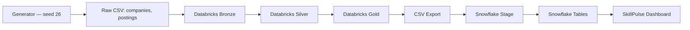

# SkillPulse

## Project No. 26 — Job Postings Skill Demand

A training company wants to know which technical skills are gaining ground in
job postings over time. SkillPulse ingests messy, defect-laden job-posting
data, cleans and normalizes it through a Bronze → Silver → Gold pipeline,
loads the analytical output into Snowflake, and serves it through a
dashboard.

**Read this first:** [`PROJECT_STATUS.md`](PROJECT_STATUS.md) states plainly
what has actually been run and verified versus what is production-ready
source code that requires your own Databricks workspace / Snowflake account
to execute. Nothing in this repository claims a result it can't show you the
receipts for — every count quoted below comes from
[`data/validation_report.json`](data/validation_report.json), which is
regenerated by running the pipeline, not typed in by hand.

## Problem Statement

Job postings mention skills in free text. A training provider needs a
repeatable way to know, month by month: which skills are most in-demand,
which are growing fastest, and which skills tend to be asked for together —
despite the source data being inconsistently delimited, inconsistently
cased, containing duplicates, and referencing companies or dates that don't
exist.

## Solution

A five-stage pipeline (Generate → Bronze → Silver → Gold → Snowflake) that:
- lands raw data unmodified in Bronze (evidence preserved),
- makes every cleaning decision exactly once in Silver, with a rejection
  reason recorded for every dropped row,
- aggregates to two Gold tables that directly answer the three analytical
  questions below,
- loads those two tables into Snowflake idempotently,
- and serves the result through **SkillPulse**, a dashboard with a light/dark
  theme toggle.

## Objectives

1. Reproducible, seeded synthetic data generation (seed = 26).
2. Demonstrable data-quality handling: duplicates, missing skills, unknown
   companies, invalid dates, inconsistent delimiters/casing/whitespace.
3. Three analytical questions answered correctly and efficiently in Spark
   SQL / Snowflake SQL:
   - Top 10 skills by posting count, per month
   - Fastest quarter-on-quarter growing skills
   - Which skills appear together (support / confidence / lift)
4. A professional, real-data dashboard — no fake filters, no hardcoded
   numbers.

## Features

- Seeded, deterministic data generator satisfying every count in the
  faculty brief (see the exact list in `docs/data-dictionary.md`).
- Bronze/Silver/Gold pipeline with fail-loud validation (17/17 checks pass
  against real, computed output — see `data/validation_report.json`).
- Snowflake schema, stage, `COPY INTO`, and the three analytical queries,
  with idempotency documented.
- SkillPulse dashboard: Overview, Skill Trends, Skill Growth, Skill
  Relationships, Data Quality, and Pipeline/About — all built from the real
  Gold-layer export, with working (not decorative) filters.
- Light/dark theme toggle. Dark mode is a warm charcoal grey, not black; no
  gradients anywhere in the UI.
- 28 real pytest tests exercising actual pipeline behavior, not stub checks.

## Architecture



See `docs/architecture.md` for the full diagram and layer-by-layer detail.

## Data Pipeline

| Stage | What happens | Verified count |
|---|---|---|
| Generate | Seed-26 synthetic companies + postings, with intentional defects | 400 companies, 55,350 raw postings |
| Bronze | Raw load, provenance columns added, nothing cleaned | 400 / 55,350 rows |
| Silver | Dedup, split/normalize skills, reject invalid rows | 54,000 deduped → 51,840 valid |
| Gold | Skill-month and skill-pair-month aggregates | 360 skill-month rows, 6,660 populated pairs |
| Snowflake | `COPY INTO` the two Gold tables | idempotent — see `sql/copy_into.sql` |

## Dataset

Generated, not downloaded — see **Important note on the generator** in
`docs/data-dictionary.md` for exactly why, and exactly what algorithm was
used (fully seeded and reproducible with `seed = 26`).

- **Companies**: 400 (`CMP000`–`CMP399`), 8 sectors × 50, 10 cities.
- **Postings**: 54,000 original, 18 months (2024-01 → 2025-06) × 3,000/month.
- **Filler skills** (16): Python, SQL, Spark, Airflow, Kafka, Hive, AWS,
  Azure, GCP, Docker, Kubernetes, Terraform, Scala, Java, PowerBI, Tableau.
- **Tracked skills** (4): Snowflake (12,726), Databricks (9,954), Hadoop
  (9,666), dbt (6,363) — all verified totals.
- **Intentional defects**: 900 empty skill fields, 450 "Not specified", 540
  unknown company (`CMP999`), 270 invalid dates, 1,350 duplicated rows,
  1,000 comma-delimited, 2,200 uppercased, 1,700 space-padded skill strings.

## Bronze Layer

Raw, untouched, string-typed, with `_source_file`, `_ingested_at`,
`_row_hash` provenance columns. See `databricks/02_bronze/02_bronze.py`.

## Silver Layer

Dedup on `posting_id` → split (comma/semicolon-aware) → normalize (trim +
lowercase, once) → reject invalid skills / unknown company / invalid date,
each with an explicit reason. See `databricks/03_silver/03_silver.py`.

## Gold Layer

`gold_skill_month` (20 skills × 18 months = 360 rows) and
`gold_skill_pair_month` (6,660 of 6,840 possible ordered pairs populated),
plus a derived `gold_skill_quarter` for QoQ growth. See
`databricks/04_gold/04_gold.py`.

## Snowflake

Database `SKILLPULSE`, schema `ANALYTICS`, internal stage
`SKILLPULSE_STAGE`. See `sql/snowflake_setup.sql`, `sql/tables.sql`,
`sql/copy_into.sql`, `sql/analytical_queries.sql`.

## Dashboard

`frontend/index.html` (template) / `frontend/dist/index.html` (built, with
real data embedded) — single self-contained file, no build step required to
view it. See **Architecture Decisions** below for why this is a static HTML
dashboard rather than a separate React frontend + hosted API.

## Data Quality

| Check | Count |
|---|---|
| Raw postings | 55,350 |
| Duplicates removed | 1,350 |
| Clean postings | 54,000 |
| Missing / "Not specified" skills | 1,350 |
| Unknown company | 540 |
| Invalid date | 270 |
| Valid postings (Gold-eligible) | 51,840 |
| Raw skill string variants | 57 |
| Canonical skills | 20 |
| Quality score (valid ÷ clean) | 96.0% |

## Testing

```
pip install -r backend/requirements.txt
pytest tests/ -v
```
28 tests, all passing, exercising the generator, Bronze, Silver, and Gold
logic with real assertions (not "does the function exist" checks). See
`docs/testing.md`.

## Installation

```
git clone <this-repo>
cd skillpulse
pip install -r backend/requirements.txt
python scripts/run_pipeline.py          # generates data, runs Bronze/Silver/Gold, validates
python scripts/export_dashboard_data.py # builds databricks/06_export/output/dashboard_data.json
python scripts/build_dashboard.py       # embeds it into frontend/dist/index.html
open frontend/dist/index.html           # or any static file server
```

## Databricks Setup

See `docs/deployment.md`. In short: run `databricks/00_setup` once, then
`01_generator` (one-time), then schedule `02_bronze` → `03_silver` →
`04_gold` → `05_validation` → `06_export` as a Databricks Job.

## Snowflake Setup

Run `sql/snowflake_setup.sql`, then `sql/tables.sql`, upload the Gold CSVs
to the stage, then `sql/copy_into.sql`. Never commit credentials — see
`.env.example`.

## Local Development

The entire pipeline runs locally in pandas (`scripts/`) for fast iteration
and to prove correctness before you touch a real Databricks/Snowflake
account. This is not a shortcut around the requirement to build real
PySpark/Snowflake code — both exist side by side; see
`docs/architecture.md` → "Two implementations, one source of truth."

## Environment Variables

See `.env.example`. Snowflake connection details are read from environment
variables; nothing is hardcoded.

## Deployment

See `docs/deployment.md` for hosting `frontend/dist/index.html` on any
static host (it's one file — Vercel, Netlify, GitHub Pages, or a plain S3
bucket all work identically). A live, hosted link and shared Google Drive
folder are provided separately per your submission instructions.

## GitHub Setup

```
git init
git add .
git commit -m "SkillPulse — Project 26"
git remote add origin <your-repo-url>
git push -u origin main
```
`.gitignore` excludes `.env`, `__pycache__/`, `node_modules/`, and generated
data (`data/sample/`, `databricks/06_export/output/` are committed as small
proof-of-run artifacts; the full 55,350-row raw file is regenerable and not
committed).

## Screenshots

See `docs/screenshots/` — add your own once you've hosted the dashboard;
none are faked here.

## Results

All 17 brief-mandated validation checks pass against real, computed
pipeline output (`data/validation_report.json`). All 28 pytest tests pass.
See `PROJECT_STATUS.md` for the full component-by-component status.

## Limitations

- The exact row-level generator algorithm for Project 26 was not supplied
  in the faculty brief (unlike Topics 31–34); this repo's generator is an
  original, documented, seed-26 design built to satisfy every stated count.
  See `docs/data-dictionary.md`.
- Databricks and Snowflake execution has **not** happened in this
  environment — the PySpark notebooks and Snowflake SQL are real,
  production-ready code, translated 1:1 from the locally-verified pandas
  logic, but they need to be run on your own workspace/account to produce
  their own execution logs.
- Sector/city filters were intentionally **not** added to Skill Trends,
  because the Gold layer doesn't currently aggregate by sector/city and a
  non-functional filter would violate the brief's "no fake filters" rule.
  Silver-layer data does carry `sector`/`city`, so this is a natural
  next step (see Future Improvements).
- No separate backend/API was hosted; the dashboard reads a static
  Gold-layer JSON export, which the brief explicitly allows ("if a separate
  backend would unnecessarily complicate deployment, create a robust
  static-data/API serving architecture"). A minimal FastAPI service that
  serves the same data is included in `backend/` for future use.

## Future Improvements

- Sector/city breakdowns in Gold, wired to real filters in Skill Trends.
- A scheduled Databricks Job (`databricks/00_setup` documents the intended
  orchestration) once a real workspace is available.
- Promote the static JSON export to the optional FastAPI service for
  live querying instead of a build-time snapshot.

## Team Contributions

_Fill in per your course's requirements — this repository was built as a
single deliverable and does not assume a team split._
# SkillPulse

